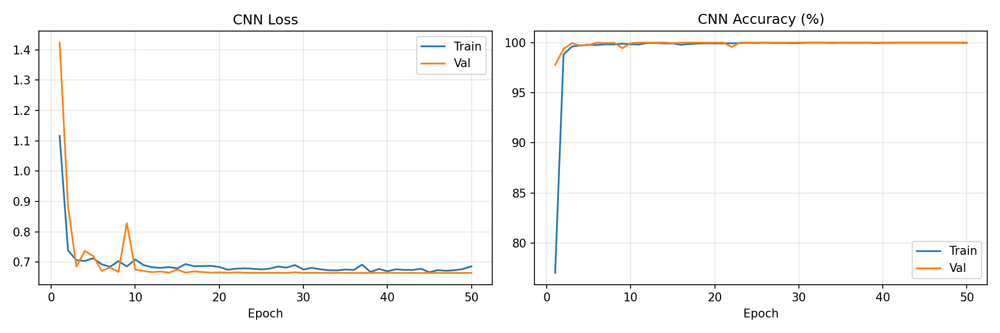
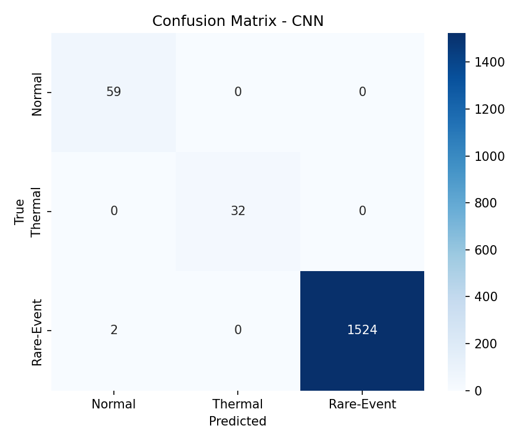
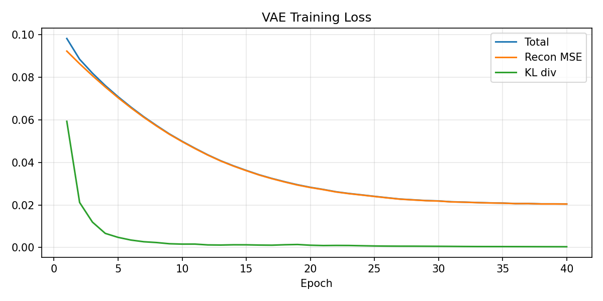
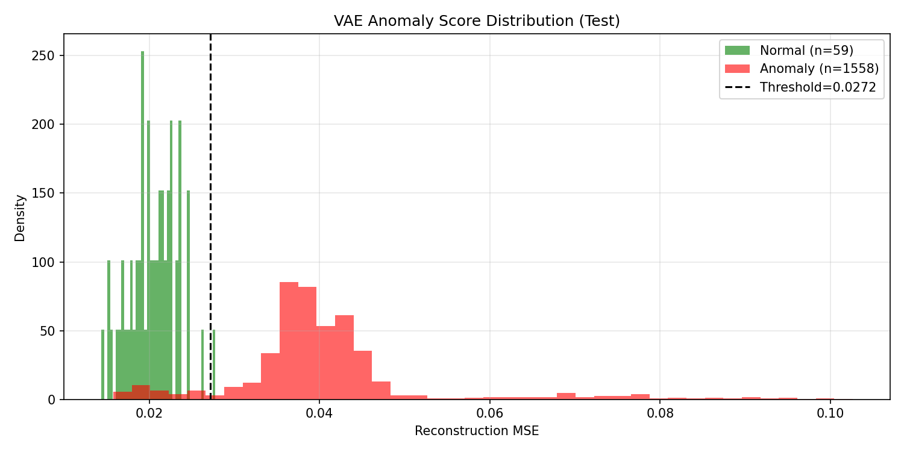

# EmAD — ESA Mission Anomaly Detection

Satellite telemetry anomaly detection for **ESA Mission 1** using two complementary models:

| Model | Type | Test Accuracy | F1 (weighted) |
|---|---|---|---|
| **1D-CNN** | Supervised multi-class classifier | **99.88 %** | **0.9988** |
| **VAE** | Unsupervised latent-space detector | 92.95 % (binary) | 0.9621 (anomaly) · AUC 0.9669 |

Both models operate on 15-day telemetry windows (Dec 2004) from 55 channels resampled to 60-second intervals. Raw signals are enriched with Savitzky–Golay derivatives and rolling statistics before training.

---

## Anomaly Classes

| ID | Class |
|---|---|
| 0 | Normal |
| 1 | Communication Anomaly |
| 2 | Power / Electrical Anomaly |
| 3 | Thermal Anomaly |
| 4 | Software / Reset / Computer Anomaly |
| 5 | Rare Nominal Event |
| 6 | Communication Gap |
| 7 | Unknown Anomaly |

---

## Project Structure

```
EmAD/
├── preprocess_to_csv.py          # Stage 1 – preprocessing pipeline
├── train_cnn1d.py                # Stage 2 – CNN + VAE training & evaluation
│
├── preprocessed_dataset.csv      # 275-feature tabular dataset  [Git LFS]
├── cnn1d_anomaly.pt              # Trained CNN weights (~5 MB)
├── vae_anomaly.pt                # Trained VAE weights (~4 MB)
│
├── reports/
│   ├── cnn_metrics_report.txt    # CNN per-class precision / recall / F1
│   ├── vae_metrics_report.txt    # VAE binary anomaly detection metrics
│   ├── cnn_training_curves.png   # Loss & accuracy over 50 epochs
│   ├── vae_loss_curves.png       # VAE total / recon / KL loss
│   ├── cm_cnn.png                # CNN confusion matrix
│   ├── cm_vae.png                # VAE binary confusion matrix
│   └── vae_score_distribution.png
│
└── esa_anomaly_detection/
    └── src/
        ├── data_loader.py        # Metadata loading & class mapping helpers
        └── preprocessing.py     # SG filter, windowing, normalisation utilities
```

> **Raw data** (`ESA-data/`, ~30 GB) is **not** included in this repo.  
> Download it from the [ESA Anomaly Detection Benchmark](https://www.esa.int) and place it at `ESA-data/ESA-Mission1/ESA-Mission1/`.

---

## Preprocessing Pipeline

`preprocess_to_csv.py` converts raw ESA pickle files into a flat tabular CSV:

1. Load **55 target channels** from `ESA-Mission1`, resampled to 60 s
2. **Clean** — drop channels with > 90 % NaN or zero variance; linear-interpolate gaps
3. **Savitzky–Golay filter** (window = 11, poly = 2) — smooth + extract 1st and 2nd derivatives per channel
4. **Rolling statistics** — 10-sample rolling mean and std per channel
5. **Label assignment** — per-timestamp multiclass label from `labels.csv` (max-priority merge)
6. **MinMax scaling** to [0, 1]
7. Save → `preprocessed_dataset.csv` (21,600 rows × 277 columns)

```
Features per channel:  smoothed · 1st deriv · 2nd deriv · rolling_mean · rolling_std
Total feature columns: 55 × 5 = 275
```

---

## Models

### 1D-CNN Classifier

Residual 1-D convolutional network trained on 50-step sliding windows (step = 2).

```
Input (275, 50)
  └─ Stem Conv7 → 64 ch
  └─ 2× ResBlock(64) → stride-2 → 128 ch
  └─ 2× ResBlock(128) → stride-2 → 256 ch
  └─ 2× ResBlock(256) → AdaptiveAvgPool
  └─ Linear(256→128) → Dropout(0.3) → Linear(128→8)
```

- **Loss:** weighted CrossEntropy + label smoothing 0.05
- **Optimizer:** AdamW, lr = 3e-4, weight decay = 1e-4
- **Schedule:** CosineAnnealingLR over 50 epochs
- **Split:** stratified random 70 / 15 / 15

### Variational Autoencoder (latent space)

Convolutional VAE trained **on Normal-class windows only**. At inference, reconstruction MSE is used as an anomaly score; a threshold at μ + 2σ (of training Normal errors) separates normal from anomalous windows.

```
Encoder: Conv1D(7) → Conv1D(5) → AdaptiveAvgPool(8) → Linear → μ, log σ²
Latent:  z ~ N(μ, σ²)   dim = 64
Decoder: Linear → ConvTranspose1D × 3 → Interpolate → Sigmoid
```

- **Loss:** MSE reconstruction + β-KL (β = 0.1)
- **AUC-ROC:** 0.9669 on test set

---

## Quick Start

### 1. Install dependencies

```bash
python -m venv .venv
# Windows
.venv\Scripts\activate
# Linux / macOS
source .venv/bin/activate

pip install torch numpy pandas scipy scikit-learn matplotlib seaborn tqdm
```

### 2. Place ESA data

```
ESA-data/
└── ESA-Mission1/
    └── ESA-Mission1/
        ├── anomaly_types.csv
        ├── channels.csv
        ├── labels.csv
        └── channels/
            ├── channel_1/channel_1
            ├── channel_2/channel_2
            └── ...
```

### 3. Run preprocessing

```bash
python preprocess_to_csv.py
# Output: preprocessed_dataset.csv
```

### 4. Train and evaluate

```bash
python train_cnn1d.py
# Outputs: cnn1d_anomaly.pt  vae_anomaly.pt  reports/
```

---

## Results

### CNN — Per-Class Report (Test Set, 1,617 windows)

| Class | Precision | Recall | F1-Score | Support |
|---|---|---|---|---|
| Normal | 0.9672 | 1.0000 | 0.9833 | 59 |
| Thermal Anomaly | 1.0000 | 1.0000 | 1.0000 | 32 |
| Rare-Event | 1.0000 | 0.9987 | 0.9993 | 1,526 |
| **Weighted avg** | **0.9988** | **0.9988** | **0.9988** | **1,617** |

### VAE — Binary Anomaly Detection (Test Set)

| | Precision | Recall | F1-Score |
|---|---|---|---|
| Normal | 0.3392 | 0.9831 | 0.5043 |
| Anomaly | **0.9993** | **0.9275** | **0.9621** |

**ROC-AUC: 0.9669**

### Training Plots

| CNN Training Curves | CNN Confusion Matrix |
|---|---|
|  |  |

| VAE Loss Curves | VAE Score Distribution |
|---|---|
|  |  |

---

## Configuration

Key hyperparameters (edit at the top of each script):

| Parameter | Value | Description |
|---|---|---|
| `WINDOW` | 50 | Sliding window length (time steps) |
| `STEP` | 2 | Window stride |
| `CNN_EPOCHS` | 50 | CNN training epochs |
| `VAE_EPOCHS` | 40 | VAE training epochs |
| `LR` | 3e-4 | Learning rate |
| `LATENT_DIM` | 64 | VAE latent space dimension |
| `VAE_BETA` | 0.1 | KL divergence weight |

---

## Data

The preprocessed dataset (`preprocessed_dataset.csv`) is tracked via **Git LFS**.

| Column group | Count | Description |
|---|---|---|
| `channel_N` | 55 | SG-smoothed telemetry value |
| `channel_N_d1` | 55 | 1st derivative (velocity) |
| `channel_N_d2` | 55 | 2nd derivative (acceleration) |
| `channel_N_rmean` | 55 | 10-sample rolling mean |
| `channel_N_rstd` | 55 | 10-sample rolling std |
| `label` | 1 | Integer class (0–7) |
| `class_name` | 1 | Human-readable class label |

---

## License

This project is for research and educational purposes. ESA telemetry data is subject to ESA's data usage terms.
